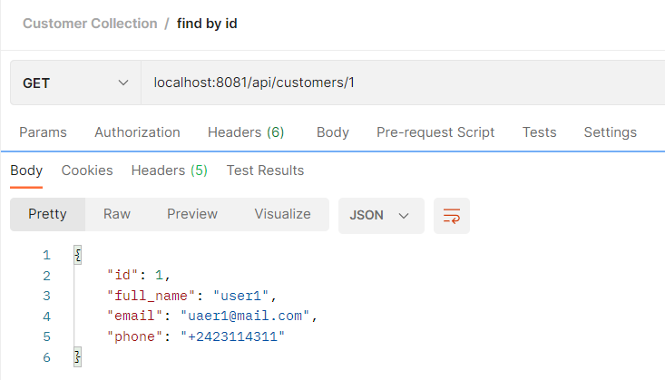

# The Raven Test Task

I need to implement HTTP API server with basic CRUD operations for Customer entity.

****
****
Backend - spring boot v2.6.7

Database - h2 (filled the db with [flyway](https://github.com/kogutenko-alex/TheRavenTestTask/tree/master/src/main/resources/db/migration))
****
****
# Endpoints
### GET

Get all: 

Get by id: 

****
### POST

Post the customer:

Get new customer by id:

****
### PUT (UPDATE)

Put updated response: 

Get updated customer by id:

****
### DELETE

Before: 

Delete by id:

After: 

****
